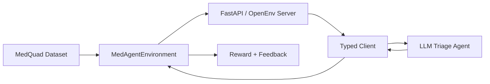

Check out the configuration reference at https://huggingface.co/docs/hub/spaces-config-reference

# MedAgent: AI Clinical Decision Support System using OpenEnv

MedAgent is an AI-powered clinical triage environment built for healthcare decision support experiments using OpenEnv. It combines the MedQuad medical Q&A dataset, an LLM-based triage agent, and a rule-based fallback policy to simulate safe patient prioritization in a one-step clinical decision setting.

The project sits at the intersection of healthcare, bioinformatics, and agentic AI. It is designed to expose a realistic clinical reasoning task through a standard `reset` / `step` / `state` interface so that decision agents can be evaluated consistently.

## Short Description

MedAgent models a lightweight clinical triage workflow where an agent receives patient context and must predict a risk level and next action. The system uses MedQuad as a knowledge source, OpenEnv as the environment interface, and an OpenAI-compatible inference client for LLM-driven decisions.

## Problem Statement

Efficient patient prioritization is critical in healthcare systems. A delayed escalation for a high-risk patient can be dangerous, while unnecessary escalation can waste limited time, staff attention, and clinical resources.

MedAgent addresses this by framing triage as a structured agent environment. The goal is not to replace real clinicians, but to create a safe evaluation surface for testing how AI systems classify urgency and recommend next steps from symptom-level patient context.

## Solution Overview

MedAgent uses a simple but modular architecture:

- A clinical triage environment built on OpenEnv and FastAPI.
- A MedQuad-backed knowledge layer that heuristically derives symptom-to-disease relationships from question-answer pairs.
- An LLM-based agent that outputs structured JSON triage decisions.
- A deterministic fallback policy that keeps the system usable when model output is invalid or unavailable.
- Reward shaping that encourages safe and accurate triage rather than binary pass/fail behavior only.

At the current stage, the project implements environment logic, client integration, inference flow, and tests. Full RL training and Docker packaging are planned but not yet implemented.

## System Architecture

The system is organized around the clinical decision loop:



Core project components:

- [server/environment.py](C:\Programming\Coding\Scalar_Hackathon\server\environment.py)
  Implements `MedAgentEnvironment`, MedQuad parsing, patient sampling, risk derivation, and reward shaping.
- [server/app.py](C:\Programming\Coding\Scalar_Hackathon\server\app.py)
  Exposes the environment as an OpenEnv-compatible FastAPI app and redirects `/` to `/docs`.
- [client.py](C:\Programming\Coding\Scalar_Hackathon\client.py)
  Provides a typed OpenEnv client for reset, step, and state handling.
- [inference.py](C:\Programming\Coding\Scalar_Hackathon\inference.py)
  Runs an OpenAI-compatible model against the environment and emits structured evaluation logs.

## Dataset

MedAgent uses the MedQuad dataset:

- Dataset: `keivalya/MedQuad-MedicalQnADataset`
- Domain: medical question-answer pairs
- Source format: natural language clinical Q&A

Important implementation note:

- The dataset does not provide a clean pre-built symptom-to-disease table.
- MedAgent derives that mapping heuristically from MedQuad question and answer text.
- The environment extracts likely disease names from symptom-related questions and then normalizes symptom phrases from the corresponding answers.

This makes the environment lightweight and practical for a hackathon setting while still staying tied to a real medical dataset.

## Key Features

- OpenEnv-compatible clinical triage environment with typed observation, action, and state models.
- MedQuad-backed symptom parsing with cached dataset loading.
- LLM-based triage agent that returns structured `risk_level` and `decision` outputs.
- Rule-based fallback policy for robustness when model output is invalid.
- Reward shaping that supports partial progress and penalizes unsafe under-triage.
- Real-time FastAPI + WebSocket interaction through the OpenEnv client abstraction.
- Modular configuration through [openenv.yaml](C:\Programming\Coding\Scalar_Hackathon\openenv.yaml), [config.yaml](C:\Programming\Coding\Scalar_Hackathon\config.yaml), and [params.yaml](C:\Programming\Coding\Scalar_Hackathon\params.yaml).

## Reward System / Evaluation

MedAgent uses a one-step episode design. Each episode ends after the agent submits one triage action.

Reward behavior in the current implementation:

- `1.0` reward for an exact risk match and exact decision match.
- Partial reward for near-miss predictions:
  - correct risk but weaker decision
  - adjacent risk severity
  - adjacent escalation level
- Unsafe under-triage is capped at a very low reward.

Current reward shaping values are documented in [params.yaml](C:\Programming\Coding\Scalar_Hackathon\params.yaml) and implemented in [server/environment.py](C:\Programming\Coding\Scalar_Hackathon\server\environment.py).

## Agent Design

The inference pipeline in [inference.py](C:\Programming\Coding\Scalar_Hackathon\inference.py) follows a strict structured-output loop:

1. Reset the environment and receive patient age and symptoms.
2. Build a prompt from the current observation.
3. Ask the model to return JSON only.
4. Parse and sanitize the returned `risk_level` and `decision`.
5. Submit the action to the environment and collect reward and feedback.

Current agent design choices:

- Prompt engineering is focused on triage urgency and structured clinical action output.
- JSON-only output is enforced at the prompt and parser level.
- Invalid or malformed model output is sanitized.
- If model generation fails, the system falls back to a deterministic rule-based policy derived from symptom markers.

## How to Run

### 1. Activate the virtual environment

```powershell
.\venv\Scripts\Activate.ps1
```

### 2. Run the environment server

```powershell
python -m server.app
```

The FastAPI docs should then be available at:

- `http://127.0.0.1:7860/docs`

### 3. Run inference

```powershell
python inference.py
```

### Required environment variables

Set these before running inference:
- `API_BASE_URL`
- `MODEL_NAME`
- `API_KEY`

Optional environment variables:

- `ENV_BASE_URL`
- `IMAGE_NAME`
- `LOCAL_IMAGE_NAME`
- `MEDAGENT_SEED`
- `MEDAGENT_MAX_STEPS`

## Configuration

MedAgent currently uses three YAML files with distinct responsibilities:

- [openenv.yaml](C:\Programming\Coding\Scalar_Hackathon\openenv.yaml)
  Minimal OpenEnv manifest used by OpenEnv tooling and environment discovery.
- [config.yaml](C:\Programming\Coding\Scalar_Hackathon\config.yaml)
  Project-level runtime, environment, agent, deployment, and logging structure.
- [params.yaml](C:\Programming\Coding\Scalar_Hackathon\params.yaml)
  Active runtime values, triage fallback markers, reward-shaping values, and placeholder defaults for future RL training work.

Important note:

- The RL-specific sections in `params.yaml` are explicitly placeholders for future work and are not active training settings in the current repo.

## Testing

Run the current test suite with:

```powershell
python -m unittest discover -s tests -v
```

What the tests currently cover:

- environment reset behavior
- exact reward behavior
- partial reward behavior
- unsafe under-triage penalty behavior
- WebSocket session flow for reset, step, and state

Current development status:

- the lightweight suite passed during development
- the real MedQuad integration smoke test is intentionally gated and skippable via `RUN_MEDQUAD_INTEGRATION=1`

## Docker

Docker support is planned, but it is not implemented yet in the current repo.

Current status:

- [Dockerfile](C:\Programming\Coding\Scalar_Hackathon\Dockerfile) exists
- it is currently empty / not configured
- containerization is intended as a future hackathon completion step

Because of that, this README does not claim a working `docker build` or `docker run` path yet.

## Results

Current results should be interpreted as development verification rather than final benchmark submission scores.

Example development signals:

- unit and integration tests passed in the lightweight test suite
- a sample environment reset returned a valid `MedAgentObservation`
- a sample patient case produced:
  - symptoms: `cough, fever, muscle aches`
  - target risk: `medium`
  - target decision: `book_consult`

Example successful outcome:

- Reward: `1.0`
- Success: `true`

This corresponds to an action that exactly matches both the environment's target risk level and target care decision.

## Why This Project Is Impactful

MedAgent matters because clinical triage is a real-world decision problem where safety, prioritization, and interpretability all matter.

Why this project is meaningful:

- It brings healthcare relevance into an agent evaluation setting.
- It connects AI, bioinformatics, and medical decision support in a practical format.
- It emphasizes decision safety by penalizing unsafe under-triage.
- It creates a reusable OpenEnv environment that can support future evaluation and training workflows.

The project is intentionally simple in its current form, but the problem it represents is genuinely important.

## Author

- Name: Anirban Majumder
- GitHub: https://github.com/ImAni07
- HuggingFace: https://huggingface.co/IamAni7
- LinkedIn: www.linkedin.com/in/anirban-majumder-49344a288

## License

License: MIT
